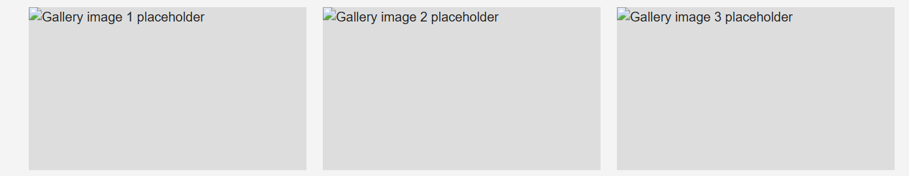
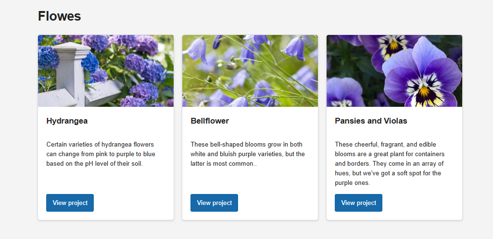
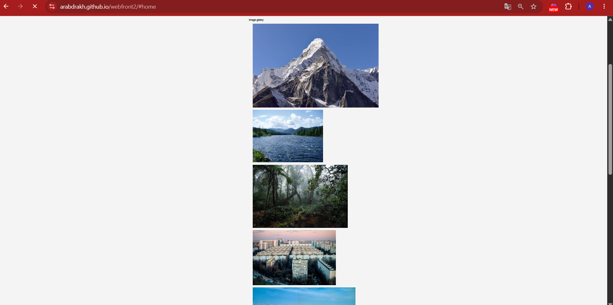
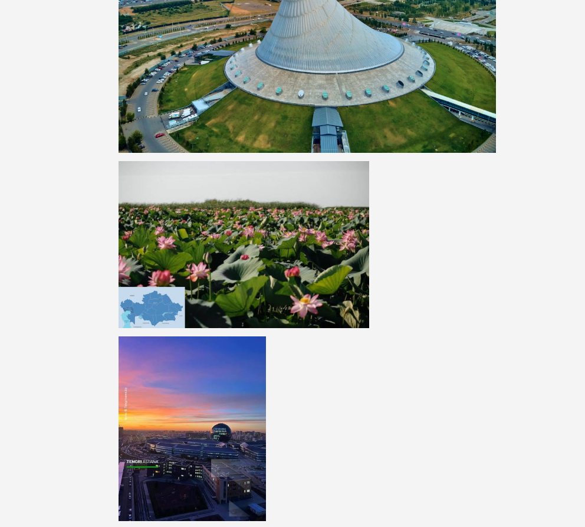
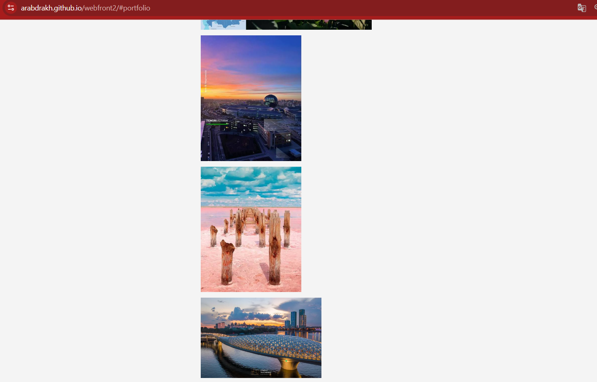
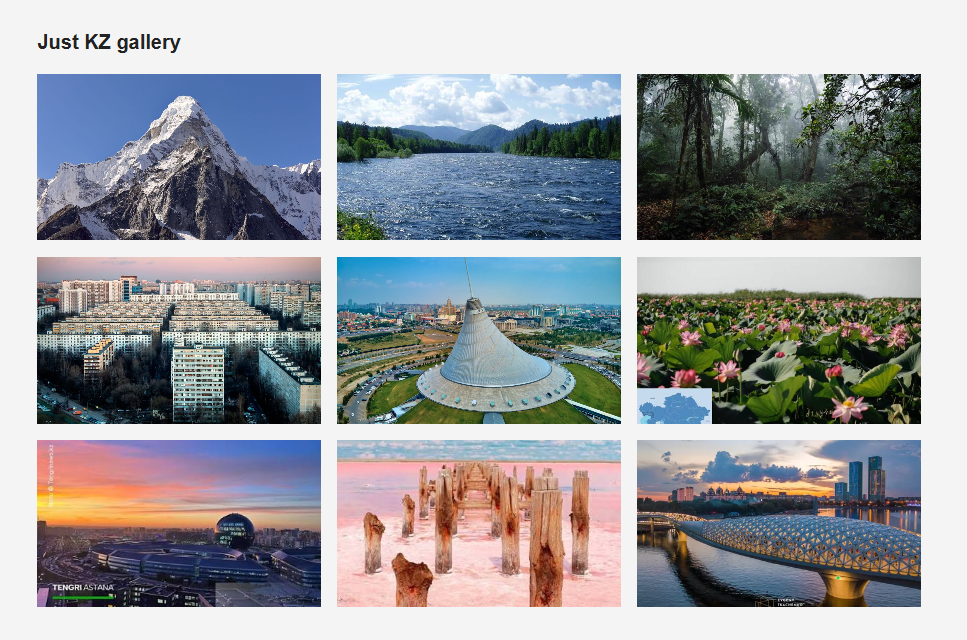
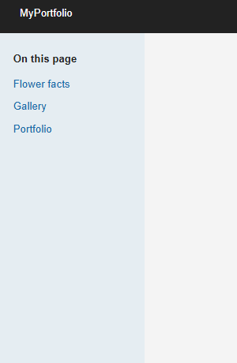
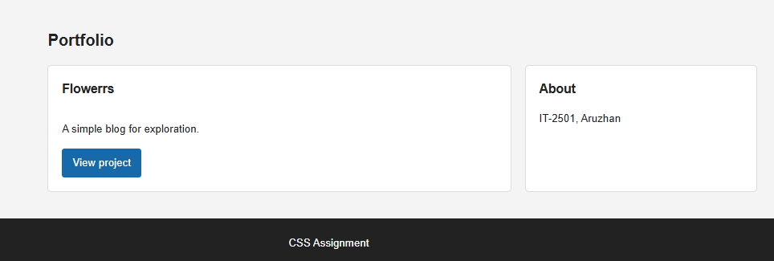
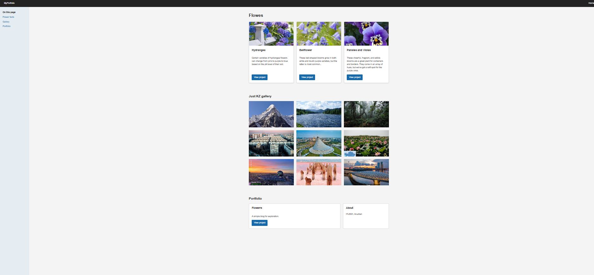

# Assignment 2: Advanced CSS (Flexbox & Grid)

- **Name:** Aruzhan
- **Group:** IT-2501

## Part 1: Flexbox

### Task 0: Navigation Bar

The header uses Flexbox to align the portfolio name and navigation links. The navigation links lead to the home and portfolio sections.

### Task 1: Card Row

The three flower cards are arranged in a row with Flexbox. Each card uses a column layout to keep its image, title, description, and button together. The images have a consistent display height so the cards line up evenly.

## Part 2: CSS Grid

### Task 2: Page Layout with Grid Areas

The page layout uses named Grid areas for the header, section navigation sidebar, main content, and footer. On narrow screens, these areas stack vertically.

### Task 3: Image Gallery

The gallery uses CSS Grid to arrange nine images in three columns on wider screens. The images are cropped consistently, and the layout adapts to smaller screens.

## Part 3: Combining Flexbox and Grid

### Task 4: Portfolio Page

The portfolio section uses Grid to place a project card on the left and an information sidebar on the right. Flexbox arranges the title, description, and button inside the project card. The page footer spans the full width.

## Work Process and Problems

I started by building the page structure, then used Flexbox for the header navigation and flower cards. I added named Grid areas for the page layout, a Grid-based gallery, and a two-column portfolio section. I checked the layout at desktop and mobile widths and adjusted the responsive rules.

One issue during development was that the gallery photos did not line up evenly. The image files have different proportions, so some items appeared larger or out of place, and early layout attempts showed the images stacked instead of forming a consistent grid. I adjusted the gallery columns and gaps, gave gallery items a consistent height, and used `object-fit: cover` so the images fit their cells. I also made the gallery switch to fewer columns on smaller screens. The screenshots below show intermediate stages of this layout work.

